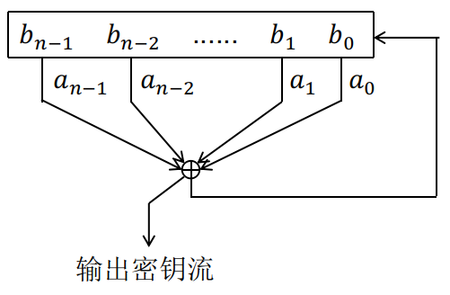

[EN](./lfsr.md) | [ZH](./lfsr-zh.md)
# 线性反馈移位寄存器 - LFSR

## 介绍

线性反馈移位寄存器的反馈函数一般如下

$a_{i+n}=\sum\limits_{j=1}^{n}c_ja_{i+n-j}$

其中，$c_j$ 均在某个有限域 $F_q$ 中。

既然线性空间是一个线性变换，我们可以得知这个线性变换为

$$ \left[ \begin{matrix} 0   & 0      & \cdots & 0 & c_n     \\ 1   & 0      & \cdots & 0 & c_{n-1}  \\ 0   & 1      & \cdots & 0 & c_{n-2}\\\vdots & \vdots & \ddots & \vdots \\ 0   & 0      & \cdots & 1 & c_1     \\ \end{matrix} \right] $$

进而，我们可以求得其特征多项式为

$f(x)=x^n-\sum\limits_{i=1}^{n}c_ix^{n-i}$

同时，我们定义其互反多项式为

$\overline f(x)=x^nf(\frac{1}{x})=1-\sum\limits_{i=1}^{n}c_ix^{i}$

我们也称互反多项式为线性反馈移位寄存器的联结多项式。

这里有一些定理需要我们记一下，感兴趣的可以自行推导。

## 特征多项式与生成函数

已知某个 n 级线性反馈移位寄存器的特征多项式，那么该序列对应的生成函数为

$A(x)=\frac{p(x)}{\overline f(x)}$

其中，$p(x)=\sum\limits_{i=1}^{n}(c_{n-i}x^{n-i}\sum\limits_{j=1}^{i}a_jx^{j-1})$。可以看出 p(x) 完全由初始状态和反馈函数的系数决定。

## 序列周期与生成函数

序列的的周期为其生成函数的既约真分式的分母的周期。

对于 n 级线性反馈移位寄存器，最长周期为 $2^{n}-1$（排除全零）。达到最长周期的序列一般称为 m 序列。

## 特殊性质

- 将两个序列累加得到新的序列的周期为这两个序列的周期的和。
- 序列是 n 级 m 序列，当且仅当序列的极小多项式是 n 次本原多项式。

## B-M 算法

一般来说，我们可以从两种角度来考虑 LFSR

- 密钥生成角度，一般我们希望使用级数尽可能低的 LFSR 来生成周期大，随机性好的序列。
- 密码分析角度，给定一个长度为 n 的序列 a，如何构造一个级数尽可能小的 LFSR 来生成它。其实这就是 B-M 算法的来源。

一般来说，我们定义一个序列的线性复杂度如下

- 若 s 为一个全零序列，则线性复杂度为0。
- 若没有 LFSR 能生成 s，则线性复杂度为无穷。
- 否则，s 的线性复杂度为生成 L(s) 的最小级的 LFSR。

BM 算法的要求我们需要知道长度为 2n 的序列。其复杂度

- 时间复杂度：O(n^2) 次比特操作
- 空间复杂度：O(n) 比特。

关于 BM 算法的细节，后续添加，目前处于学习过程中。

但是其实如果我们知道了长度为 2n 的序列，我们也可以一种比较笨的方法来获取原先的序列。不妨假设已知的序列为$a_1,...,a_{2n}$，我们可以令

$S_1=(a_1,...,a_n)$

$S_2=(a_2,...,a_{n+1})$

....

$S_{n+1}=(a_{n+1},...,a_{2n})$

那么我们可以构造矩阵 $X=(S_1,...,S_n)$，那么

$S_{n+1}=(c_n,...,c_1)X$

所以

$(c_n,...,c_1)=S_{n+1}X^{-1}$

进而我们也就知道了 LFSR 的反馈表达式，进而我们就可以推出初始化种子。

## 2018 强网杯 streamgame1

简单看一下题目

```python
from flag import flag
assert flag.startswith("flag{")
assert flag.endswith("}")
assert len(flag)==25

def lfsr(R,mask):
    output = (R << 1) & 0xffffff
    i=(R&mask)&0xffffff
    lastbit=0
    while i!=0:
        lastbit^=(i&1)
        i=i>>1
    output^=lastbit
    return (output,lastbit)


R=int(flag[5:-1],2)
mask    =   0b1010011000100011100

f=open("key","ab")
for i in range(12):
    tmp=0
    for j in range(8):
        (R,out)=lfsr(R,mask)
        tmp=(tmp << 1)^out
    f.write(chr(tmp))
f.close()
```

可以发现，flag 的长度为25-5-1=19，所以可以暴力枚举。结果

```shell
➜  2018-强网杯-streamgame1 git:(master) ✗ python exp.py
12
0b1110101100001101011
```

因此 flag 为 flag{1110101100001101011}。

## 2018 CISCN 初赛 oldstreamgame

简单看一下题目

```shell
flag = "flag{xxxxxxxxxxxxxxxx}"
assert flag.startswith("flag{")
assert flag.endswith("}")
assert len(flag)==14

def lfsr(R,mask):
    output = (R << 1) & 0xffffffff
    i=(R&mask)&0xffffffff
    lastbit=0
    while i!=0:
        lastbit^=(i&1)
        i=i>>1
    output^=lastbit
    return (output,lastbit)

R=int(flag[5:-1],16)
mask = 0b10100100000010000000100010010100

f=open("key","w")
for i in range(100):
    tmp=0
    for j in range(8):
        (R,out)=lfsr(R,mask)
        tmp=(tmp << 1)^out
    f.write(chr(tmp))
f.close()
```

程序很简单，仍然是一个 LFSR，但是初态是 32 比特位，当然，我们也可以选择爆破，但是这里不选择爆破。

这里给出三种做法。


具体分析如下：首先此题的LFSR模型如图所示



其中 $a_{n-1},a_{n-2},\cdots,a_0$ 为程序中 mask 的二进制位，当 $a_i=1$ 时，将 $b_i$ 输入异或运算，否则 $b_i$ 不输入异或运算；根据模型我们可以得到如下等式：


其中的加法为异或，由于 $a_{n-1}=1$ ，故将上述等式重写为：


从而，由异或的性质


再将等式“还原”


为了让你理解得更清楚，把列反序一下


所以你也看明白了，只需要输出密钥流的32个连续的比特，将 $R$ 的二进制位初始化为 $k_{n} k{n-1}\cdots k_{2} k_{1}$ ，再循环右移 1 位，输入函数 lfsr，则 lfsr 输出的就是初始种子的第一个比特，接下来 $R$ 的二进制位的更新方式为：先循环右移 1 位，然后将左起第 2 位用 lfsr 输出的密钥流替换，然后将 $R$ 重新输入函数 lfsr，直到算出初始种子的全部比特位。

代码如下（这里我把题目脚本命名为 chaleng2.py ，这样我可以复用函数 lfsr ）
```python
from chaleng2 import lfsr

with open("key","rb") as f:
    stream=f.read(4)
s=''.join([bin(256+ord(it))[3:] for it in stream])
R=int(s[31:]+s[:31],2)
mask = 0b10100100000010000000100010010100
ss=''
for j in range(32,0,-1):
    (_,tk)=lfsr(R,mask)
    ss=str(tk)+ss
    R=int(s[j-2]+str(tk)+bin(R)[2:].rjust(32,'0')[1:-1],2)
print 'flag{'+hex(int(ss,2))[2:]+'}'
```

运行

```shell
➜  2018-CISCN-start-oldstreamgame git:(master) ✗ python exp2.py
flag{926201d7}
```

第二种做法，程序输出的第 32 个比特是由程序输出的前 31 个比特和初始种子的第 1 个比特来决定的，因此我们可以知道初始种子的第一个比特，进而可以知道初始种子的第 2 个比特，依次类推。
代码如下
```python
mask = 0b10100100000010000000100010010100
b = ''
N = 32
with open('key', 'rb') as f:
    b = f.read()
key = ''
for i in range(N / 8):
    t = ord(b[i])
    for j in xrange(7, -1, -1):
        key += str(t >> j & 1)
idx = 0
ans = ""
key = key[31] + key[:32]
while idx < 32:
    tmp = 0
    for i in range(32):
        if mask >> i & 1:
            tmp ^= int(key[31 - i])
    ans = str(tmp) + ans
    idx += 1
    key = key[31] + str(tmp) + key[1:31]
num = int(ans, 2)
print hex(num)
```

运行

```shell
➜  2018-CISCN-start-oldstreamgame git:(master) ✗ python exp1.py
0x926201d7
```

第三种做法，我们可以考虑一下矩阵转换的过程，如果进行了 32 次线性变换，那么就可以得到输出流前 32 个比特。而其实，我们只需要前 32 个比特就可以恢复初始状态了。


```python
mask = 0b10100100000010000000100010010100

N = 32
F = GF(2)

b = ''
with open('key', 'rb') as f:
    b = f.read()

R = [vector(F, N) for i in range(N)]
for i in range(N):
    R[i][N - 1] = mask >> (31 - i) & 1
for i in range(N - 1):
    R[i + 1][i] = 1
M = Matrix(F, R)
M = M ^ N

vec = vector(F, N)
row = 0
for i in range(N / 8):
    t = ord(b[i])
    for j in xrange(7, -1, -1):
        vec[row] = t >> j & 1
        row += 1
print rank(M)
num = int(''.join(map(str, list(M.solve_left(vec)))), 2)
print hex(num)
```


运行脚本

```shell
➜  2018-CISCN-start-oldstreamgame git:(master) ✗ sage exp.sage
32
0x926201d7
```

从而 flag 为 flag{926201d7}。

还有一种做法是 TokyoWesterns 的，可以参考对应的文件夹的文件。

## 题目


## 参考文献

- 密码学讲义，李超，屈龙江编著
